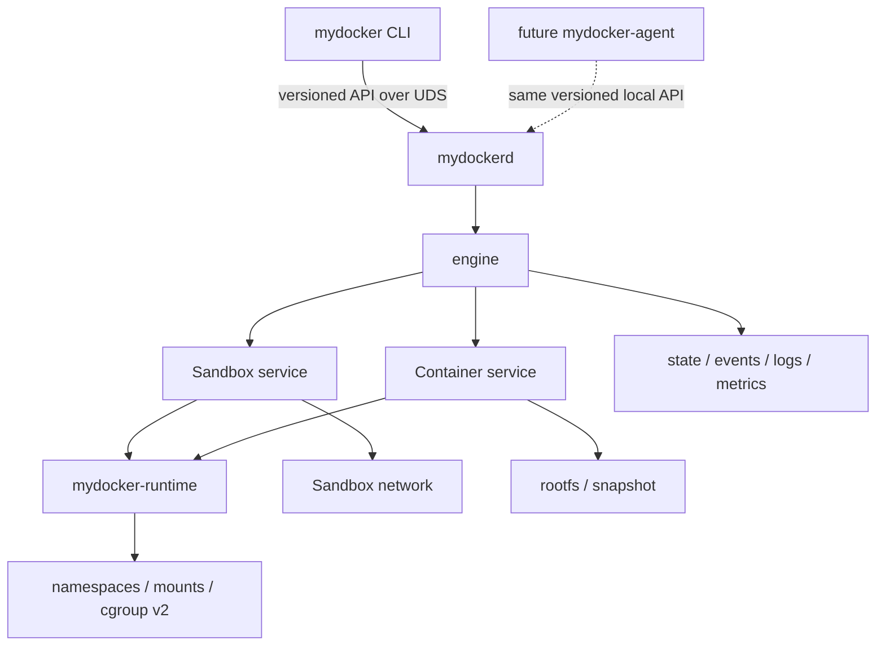

# mydocker 2.0

mydocker 2.0 计划实现为一个仅支持 Linux、以 rootful 模式运行的轻量级容器 runtime
和单节点容器引擎，用于学习并验证隔离、生命周期可靠性、资源控制、恢复和性能工程。

## 当前状态

**M0 状态：仓库和文档初始化已达到 Verified。** 这并不代表未来任何 runtime
行为已经过验证。

当前分支的工作树中**只有 M0 仓库初始化文档**。mydocker 2.0 的 runtime、daemon、
API、Sandbox 实现、benchmark harness 或集群组件均尚不存在。不要根据 legacy 项目
推断 2.0 中存在可运行的命令。

仓库的实际 Git 布局与最初的分支名称提案不同：

| Ref | 仓库事实 | 用途 |
| --- | --- | --- |
| `origin/legacy/v1`, `v0.1.0-legacy` | 保留的 Legacy commit | 冻结的教程实现 |
| `main` | 现有的空 root | 上游默认/初始化 root；无 runtime 或文档 |
| `mydocker-2.0` | 本地 M0 分支 | 单节点 runtime 和引擎开发 |
| `mydocker-cluster` | 不存在 | 通过 2.0 gate 后的未来集群分支 |

`main` 与 `origin/legacy/v1` 是两条彼此独立、没有共同祖先的 root histories。
legacy tag 使旧实现仍可被定位，而无需将其代码复制到这棵彻底重写的工作树中。
M0 未修改任何远程分支或默认分支设置。已验证的仓库事实见
[legacy 审计](docs/legacy.md)。

## Legacy 与 2.0 对比

legacy 项目是一个教学实现，包含单体 CLI、Linux namespaces、cgroup v1 风格的
controllers、OverlayFS 工作区配置、bridge/veth 网络、本地 IPAM，以及基于文件的
容器状态。它仍然只是参考，并不构成 API 或状态兼容性契约。

mydocker 2.0 将围绕显式状态机、rollback、daemon recovery、cgroup v2、稳定的
Sandbox 身份、版本化本地 API 和可复现评测进行彻底重写。M0 不迁移 legacy 业务代码。

## 以 Sandbox 为核心的模型

**Sandbox** 拥有稳定的 workload 边界：身份、生命周期、network namespace 和地址、
UTS/IPC namespaces、hostname/DNS 设置、port mappings、labels、父 cgroup，以及
namespace keeper 或 supervisor 的身份。

**Container Attempt** 拥有一次执行：进程、受 OCI 启发的 bundle、rootfs/snapshot、
mount 和 PID namespaces、子 cgroup、logs、退出码、信号和 OOM 结果。初期，一个
Ready Sandbox 最多只能有一个 active Attempt，但在保持稳定网络身份的同时，可以承载
多个连续的 Attempts。

在首版 API 中，每条用户可见的 `Container` 记录恰好对应一个 Attempt，并会返回两个
ID。terminal outcome 之后的 workload retry 会在同一 Sandbox 中创建新的 pair；
transport retry 则复用原 operation ID 和 pair。

权威的所有权与状态机设计见 [architecture.md](docs/architecture.md)；生命周期细节见
[lifecycle-sandbox.md](docs/features/lifecycle-sandbox.md)。

## 评测优先模型

度量与生命周期一同设计，而不是事后附加。每个外部 operation 都会拥有 operation ID
和 stage events。Cold Sandbox 创建、Container 创建、Container 启动、完整 cold start
和 warm Attempt restart 分别作为独立指标。Correctness tests、stress tests、fault tests、
benchmarks 和 profiling 各自回答不同问题。

M0 没有任何性能结果。只有在建立可复现且经过正确性检查的基线后，才会开始优化。
度量契约见 [evaluation/README.md](evaluation/README.md)。

## 目标架构

CLI 不会拥有 detached workloads。`mydockerd` 将协调单节点状态；低层 runtime 代码
只理解 process、namespace、mount、bundle 和 cgroup 原语。未来的 agent 必须使用
公共本地 API，且不得导入 runtime 内部实现。

## 范围

计划中的 2.0 范围包括：

- Sandbox 和 Container Attempt 生命周期；
- 受 OCI 启发的 bundles，以及结构化的 argv/environment；
- Linux namespaces、`pivot_root`、mounts 和 cgroup v2；
- rootfs/snapshot，以及 Sandbox bridge/veth/IPAM 网络；
- 长期运行的 daemon、supervisor/shim、版本化 UDS API 和持久元数据；
- rollback、idempotency、daemon restart reconciliation、logs、events 和 metrics；
- correctness、integration、fault、stress、benchmark 和 profiling 工作流。

## 2.0 非目标

- scheduler、workload placement、node heartbeat、lease、etcd 或 cluster controller；
- 多节点 overlay 网络或 cluster API server；
- Kubernetes kubelet 集成、CRI 兼容或完整 Pod 语义；
- 声称完全兼容 OCI/containerd；
- 初始设计中的 rootless 运行；
- 可重复度量前的性能结论。

## 安全

计划中的 runtime 仅支持 Linux 且以 rootful 模式运行。Namespace、mount、cgroup、
bridge、veth 和 firewall 操作可能改变宿主机。未来的特权 integration、stress 和 fault
场景只能在隔离的一次性机器或 VM 中完成 preflight 后运行。M0 不运行任何特权容器操作。

## 文档

建议阅读顺序：

1. 本 README。
2. [架构](docs/architecture.md)。
3. [路线图](docs/roadmap.md)。
4. 相关的[功能文档](docs/features/lifecycle-sandbox.md)。
5. 涉及测试或度量工作时阅读[评测契约](evaluation/README.md)。

其他参考资料：

- [Legacy 审计](docs/legacy.md)
- [隔离与资源](docs/features/isolation-resources.md)
- [存储与网络](docs/features/storage-network.md)
- [Daemon、恢复、可观测性与 API](docs/features/daemon-recovery-observability-api.md)
- [未来集群兼容性](docs/features/cluster-compatibility.md)

实现顺序和 milestone gates 仅由[路线图](docs/roadmap.md)定义。在相关 milestone 完成
Implemented 并达到 Verified 之前，这些文档中的每项设计都只是 **Proposed** 或
**Planned**，不代表相应行为已经可用。
