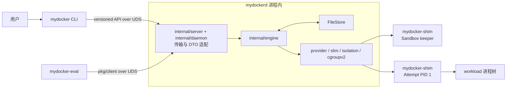

# mydocker 2.0：单节点容器运行时与执行引擎

mydocker 2.0 计划实现为一个仅支持 Linux、以 rootful 模式运行的**单节点容器执行引擎**
（Node-local Container Execution Engine）。它是容器化 workload 的节点执行面：给定镜像
digest、命令、资源限制和网络配置，负责在一台 Linux 节点上准备 rootfs、创建 Sandbox、
执行并监督进程、维护状态、处理失败、恢复 daemon、清理资源，并以可复现方式度量结果。

**mydocker 2.0 的完整目标只消费 OCI 镜像，不负责构建镜像。** M4+ 计划实现
`OCI image -> rootfs/snapshot -> container process` 的镜像消费链路；当前 M3 只接收
daemon 配置的 prepared-rootfs ID，尚未实现镜像导入、内容存储或 snapshot。项目不实现
Dockerfile 构建、`docker commit`、镜像 push 或 registry server。未来的 mycluster 是独立的
Distributed Workload Control Plane（分布式工作负载控制面），负责跨节点的放置、期望
状态调谐和故障恢复；mydocker 不承担这些全局控制面职责。

## 当前状态

**M0 状态：仓库和文档初始化已达到 Verified。** 这并不代表未来任何 runtime
行为已经过验证。

**M1 状态：生命周期基础已达到 Verified。** 当前实现是纯 Go 的领域模型、状态机、
operation/event、rollback、事务状态边界和两阶段生命周期协调契约；Ready、Created、
Running、`running -> stopped` 及 metadata 删除都要求明确外部验证。启动前删除可依据
尚未运行这一已持久事实进入 `stopped/not_applicable`，但真正删除仍需确认资源不存在。

**M2 状态：Verified（M2 范围）。** 当前已有 rootful Linux
namespace/mount/rootfs 原语、cgroup v2 Sandbox/Attempt 父子层级、pidfd 强身份、
宿主机所有权 receipt/checkpoint/rollback 与窄 provider 契约。CPU period 固定为
`100000` µs，缺省 pids limit 为 `1024`；CPU/memory requests 不会写入
enforcement controllers。这些边界已通过纯单元测试、race detector、静态检查，以及
一次性 KVM 来宾机中的真实 namespace/mount/PID 1/cgroup v2/limits/OOM 验收。

**M3 状态：Verified（M3 精简 provider 范围）。** 已实现带版本的 HTTP/JSON over UDS 契约、
`pkg/client`、JSON CLI、持久 `FileStore`、engine、shim 协议与精简 provider、
operations/events/logs 查询、daemon 重启协调、终态观测及 kill deadline 后台恢复，
以及只调用公共 API 的 `mydocker-eval` 评测工具。纯 Go、临时文件系统、注入 provider
和公共 UDS 组合测试均已通过。

生产 `LinuxShimLauncher` 已组合持久 launch intent、cgroup-at-fork、pidfd、
namespace reattach、keeper/init bootstrap、作用时校验与控制协议；兼容宿主机上的
只读 preflight 和恢复会在 UDS 绑定前完成。2026-08-25，该生产组合在专用、一次性
Ubuntu 24.04 KVM 来宾机中通过了默认关闭的
[M3 rootful 一次性主机套件](integration/rootful/README.md)：真实验证
`network=none`、PID namespace 内 PID 1、prepared-rootfs pivot、日志与 exit 23；
验证 loopback、hostname/DNS、CPU/memory/pids controller 读回、daemon 关闭后重开与
经身份校验的 SIGTERM；并以 `memory.events.local` 和公共 outcome 双重确认 OOM。
套件结束后专用 cgroup root 无子 cgroup、无 member，工作根无残留 mount 或 shim 进程。
当前 workload 也尚无 UID/GID、capability、`no_new_privs`、seccomp 或 LSM 执行配置；
root workload 与 init shim 同属宿主 user namespace，因而 shim 持有的跨-pivot descriptor
不能被当作抵御恶意 workload 的安全边界。M3 只能运行受信测试 workload，且只能放在
可销毁验收环境中；`Verified` 只表示路线图规定的 M3 正确性门已通过，不是生产安全、
多租户隔离或长期运行可用性声明。
`FileStore` 已实现按数量的 operation/event retention、原子 compaction 和版本化
resume-gap 错误，但默认 `65536` 个 operation identity 是
fail-closed 的硬生命周期上限，尚无在线 rollover/归档流程；这不是“无限历史”的
生产方案。M3 仍只映射管理员配置的共享 prepared-rootfs，不创建每 Attempt snapshot；
镜像/content/snapshot、完整 veth/IPAM 网络、hostile-workload 安全 profile、长期 stress
和在线状态轮换分别属于 M4+/M5 后续范围。

仓库的实际 Git 布局与最初的分支名称提案不同：

| Ref | 仓库事实 | 用途 |
| --- | --- | --- |
| `origin/legacy/v1`, `v0.1.0-legacy` | 保留的 Legacy commit | 冻结的教程实现 |
| `main` | 现有的空 root | 上游默认/初始化 root；无 runtime 或文档 |
| `mydocker-2.0` | 本地 M0–M3 开发分支 | 单节点容器执行引擎开发 |
| `mydocker-cluster` | 不存在 | 通过 2.0 gate 后派生未来 mycluster 的计划分支名 |

`main` 与 `origin/legacy/v1` 是两条彼此独立、没有共同祖先的 root histories。
legacy tag 使旧实现仍可被定位，而无需将其代码复制到这棵彻底重写的工作树中。
M0 未修改任何远程分支或默认分支设置。已验证的仓库事实见
[legacy 审计](docs/legacy.md)。

## 当前如何构建和操作

在普通开发主机上，当前可安全执行的是编译、纯测试和静态检查：

```bash
go mod verify
go build ./cmd/... ./evaluation/cmd/...
go test ./...
go test -race ./...
go vet ./...
```

上述命令不执行 namespace、mount 或 cgroup 宿主机副作用。不要在普通主机上
为了“试跑”而给命令加 `sudo`；真实 rootful 验收必须在一次性 Linux VM 中
完成 preflight 后单独进行。

`mydockerd` 当前要求下列参数全部显式给出；路径必须是干净、绝对且
不能是文件系统根目录。这是配置契约，不是当前可成功启动的操作清单：

| 参数 | 用途 |
| --- | --- |
| `--state` | 持久 `FileStore` 文件 |
| `--runtime-root` | shim、stream 和 owner-bound 临时 artifact 的私有目录 |
| `--socket` | 对外 HTTP/JSON UDS 路径 |
| `--cgroup-root` | 已委托的专用 cgroup v2 目录 |
| `--shim` | `mydocker-shim` 可执行文件绝对路径 |
| `--prepared-rootfs ID=/absolute/path` | 可重复；将 API 中的 opaque rootfs ID 绑定到受信路径 |
| `--shutdown-timeout` | API 排空与后台 watcher 停止两个阶段各自的上限，默认每阶段 `15s` |

CLI 请求使用严格 JSON 文件。固定 wire 字段名必须与 API 声明精确匹配大小写，不能把
`mode` 写成 `Mode` 或 `MODE`；map key 则保持大小写敏感，大小写不同的键可以同时存在。
完整边界见
[Daemon、恢复、可观测性与本地 API](docs/features/daemon-recovery-observability-api.md)。
以下示例可连接注入 provider 的测试 server；若连接生产 `mydockerd`，只能在已完成
preflight 的一次性 rootful 验收环境中使用。例如 `sandbox.json`：

```json
{
  "sandbox_id": "sandbox-demo",
  "spec": {
    "network": { "mode": "none" },
    "resources": { "requests": {}, "limits": {} }
  }
}
```

```bash
go run ./cmd/mydocker \
  --socket /run/mydocker/mydockerd.sock \
  --operation-id op-sandbox-demo-001 \
  sandbox create --input sandbox.json
```

`container.json` 保持 argv/environment 的结构，`rootfs` 填写 daemon 配置过的
opaque ID，而不是客户端自行选择宿主机路径：

```json
{
  "container_id": "container-demo",
  "attempt_id": "attempt-demo",
  "process": {
    "argv": ["/bin/sleep", "30"],
    "working_directory": "/",
    "termination": {
      "signal": "SIGTERM",
      "grace_period_ns": 2000000000,
      "escalation_signal": "SIGKILL"
    }
  },
  "rootfs": "prepared-rootfs-baseline-v1"
}
```

```bash
go run ./cmd/mydocker --socket /run/mydocker/mydockerd.sock \
  --operation-id op-container-demo-001 \
  container create --input container.json sandbox-demo
go run ./cmd/mydocker --socket /run/mydocker/mydockerd.sock \
  --operation-id op-start-demo-001 container start container-demo
go run ./cmd/mydocker --socket /run/mydocker/mydockerd.sock events --limit 100
go run ./cmd/mydocker --socket /run/mydocker/mydockerd.sock \
  logs --attempt-id attempt-demo --limit 100 container-demo
```

可变操作的 `--operation-id` 必须在首次发送前产生，并在传输重试时保持不变；
不同请求体不得复用同一 ID。CLI 也支持 `sandbox get/list/stop/delete`、
`container get/list/kill/delete`、`operation get`、events resume 和 identity-bound log cursor。
当前这些 CLI 示例只说明编码与操作契约；生产 launcher 已编码并不等于其真实内核路径
已经验收，普通开发主机上不得用 `sudo` 试跑。

默认状态保留策略保存最近 `1024` 个终态 operation 的完整响应、最多 `65536` 个
完整 operation 或已过期 identity tombstone，以及最近 `8192` 个 event。过期
operation ID 返回 `operation_expired`，不得自动换 ID 重做；非空 event resume token
落在已清理前缀或超过最新已提交事件时返回 `resume_gap`，显式传空 token 才会从当前
最早可用事件重新开始。
identity 上限返回 `resource_exhausted`，需要运维迁移/轮换状态，自动重试无效。
状态 envelope 另有 `64 MiB` 总上限，因此较大的响应或事件也可能先触发拒绝。

## Legacy 与 2.0 对比

legacy 项目是一个教学实现，包含单体 CLI、Linux namespaces、cgroup v1 风格的
controllers、OverlayFS 工作区配置、bridge/veth 网络、本地 IPAM，以及基于文件的
容器状态。它仍然只是参考，并不构成 API 或状态兼容性契约。

mydocker 2.0 将围绕显式状态机、rollback、daemon recovery、cgroup v2、稳定的
Sandbox 身份、版本化本地 API 和可复现评测进行彻底重写。M0 不迁移 legacy 业务代码。

它不是“小 Docker”或 Docker API 替代品。在完整的 2.0 目标中，镜像生产由外部 builder
完成；M4+ 的 mydocker 将消费 OCI Image Layout，验证并保存内容，解包 layers，为每个
Attempt 准备可写 snapshot/rootfs，再构建底层 runtime 能力边界可消费的 bundle。当前
M3 只有 prepared-rootfs 路径，不包含这条镜像、snapshot 或 bundle 链路。

## 以 Sandbox 为核心的模型

**Sandbox** 拥有稳定的 workload 边界：身份、生命周期、UTS/IPC/network namespaces、
hostname/DNS 设置、labels、父 cgroup，以及 namespace keeper 或 supervisor 的身份。
当前 M3 的网络模式只有 none/loopback；地址、bridge/veth、IPAM 和 port mappings 是 M4+
的完整网络目标。

**Container Attempt** 拥有一次执行：进程、mount 和 PID namespaces、子 cgroup、
logs、退出码、信号、OOM 结果，以及当前 prepared-rootfs 的 mount 视图与 receipt。
M3 不创建每 Attempt 独享 snapshot；那是 M4+ 目标。初期，一个 Ready Sandbox 最多只能
有一个 active Attempt，但在保持稳定网络身份的同时，可以承载多个连续的 Attempts。

在首版 API 中，每条用户可见的 `Container` 记录恰好对应一个 Attempt，并会返回两个
ID。terminal outcome 之后的 workload retry 会在同一 Sandbox 中创建新的 pair；
transport retry 则复用原 operation ID 和 pair。

权威的所有权与状态机设计见 [architecture.md](docs/architecture.md)；生命周期细节见
[lifecycle-sandbox.md](docs/features/lifecycle-sandbox.md)。

## 评测优先模型

度量与生命周期一同设计，而不是事后附加。每个外部 operation 都会拥有 operation ID
和 stage events。Cold Sandbox 创建、Container 创建、Container 启动、完整 cold start
和 warm Attempt restart 分别作为独立指标。Correctness tests、stress tests、fault tests、
benchmarks 和 profiling 各自回答不同问题。

当前没有任何性能结果。只有在建立可复现且经过正确性检查的基线后，才会开始优化。
度量契约见 [evaluation/README.md](evaluation/README.md)。

## 当前进程与目标能力边界

运行时交付面只有三个程序入口：`mydocker` CLI、常驻的 `mydockerd`，以及由 daemon
启动的 `mydocker-shim`；此外还有直接使用 `pkg/client` 的独立评测程序
`mydocker-eval`。它只通过公共 API 定义 sample 边界并写出原始证据，不是 daemon、
provider 或生产运行时层。`engine` 是 `mydockerd` 内的 Go package；`Container Attempt`
是一次执行的持久领域记录；低层 runtime 是职责边界，当前并不存在
`cmd/mydocker-runtime` 二进制。完整的当前进程图和 Docker/containerd/runc 对照见
[组件模型](docs/architecture.md#2-组件模型)。



CLI 不会拥有 detached workloads。`mydockerd` 协调单节点状态；当前低层实现只处理
process、namespace、mount、prepared rootfs 和 cgroup 原语，不理解镜像 tag、registry、
layer 下载或 cache。Image/content/snapshot/bundle/network 的完整路径是 M4+ 目标；未来
bundle 到进程的职责仍止于这一低层能力边界。未来的 agent 必须使用公共本地 API，且
不得导入 runtime 内部实现。

## 范围

计划中的 2.0 范围包括：

- Sandbox 和 Container Attempt 生命周期；
- OCI Image Layout 导入、digest 校验、内容寻址 blob store 和 layer unpack；
- 不可变 image filesystem、每个 Attempt 的 OverlayFS snapshot、rootfs/mount 和
  受 OCI 启发的 bundle；
- 结构化的 argv/environment；
- Linux namespaces、`pivot_root`、mounts 和 cgroup v2；
- Sandbox bridge/veth/IPAM 网络；
- 长期运行的 daemon、supervisor/shim、版本化 UDS API 和持久元数据；
- rollback、idempotency、daemon restart reconciliation、logs、events 和 metrics；
- correctness、integration、fault、stress、benchmark 和 profiling 工作流。

## 2.0 非目标

- scheduler、workload placement、node heartbeat、lease、etcd 或 cluster controller；
- 多节点 overlay 网络或 cluster API server；
- Dockerfile frontend/build graph/cache、镜像构建、`docker commit`、push 或
  registry server；
- 自动 snapshot/content GC、多架构 image index、镜像签名、SBOM 或 lazy pull；
- Kubernetes kubelet 集成、CRI 兼容或完整 Pod 语义；
- 声称完全兼容 OCI/containerd；
- 初始设计中的 rootless 运行；
- 可重复度量前的性能结论。

## 安全

计划中的 runtime 仅支持 Linux 且以 rootful 模式运行。Namespace、mount、cgroup、
bridge、veth 和 firewall 操作可能改变宿主机。特权 integration、stress 和 fault
场景只能在隔离的一次性机器或 VM 中完成 preflight 后运行。M2/M3 的 rootful 验收
严格在任务专用 KVM 来宾机内执行；普通开发宿主机只运行非特权检查并负责传输源码与
收集日志。后续 M4+/M5 特权场景仍必须重新使用相同的隔离和双重 opt-in 安全门。

## 文档

建议阅读顺序：

1. 本 README。
2. [架构](docs/architecture.md)。
3. [路线图](docs/roadmap.md)。
4. 相关的[功能文档](docs/features/lifecycle-sandbox.md)。
5. 涉及测试或度量工作时阅读[评测契约](evaluation/README.md)。

其他参考资料：

- [Legacy 审计](docs/legacy.md)
- [隔离与资源](docs/features/isolation-resources.md)
- [镜像与文件系统](docs/features/image-filesystem.md)
- [Sandbox 网络](docs/features/network.md)
- [Daemon、恢复、可观测性与 API](docs/features/daemon-recovery-observability-api.md)
- [未来集群兼容性](docs/features/cluster-compatibility.md)

实现顺序和 milestone gates 仅由[路线图](docs/roadmap.md)定义。M1 已验证纯领域与
协调契约；M2/M3 已通过各自范围内的非特权与一次性 KVM rootful 门。在线状态轮换、
per-Attempt snapshot、完整网络、安全执行 profile、压力/故障矩阵和生产 SLO 尚未完成，
所以不得把 M3 `Verified` 扩写成“生产可用”。M4+ 设计在相关 milestone 达到 Verified
前仍是 **Proposed** 或 **Planned**，不代表相应行为已经可用。
