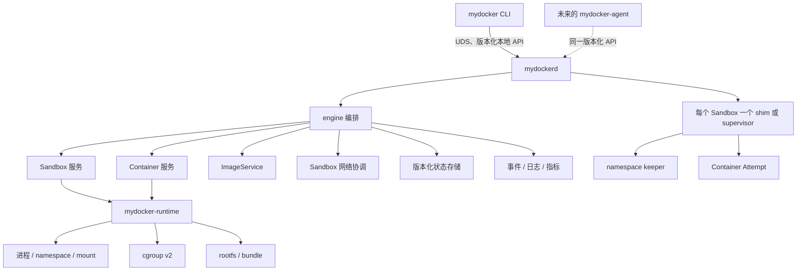
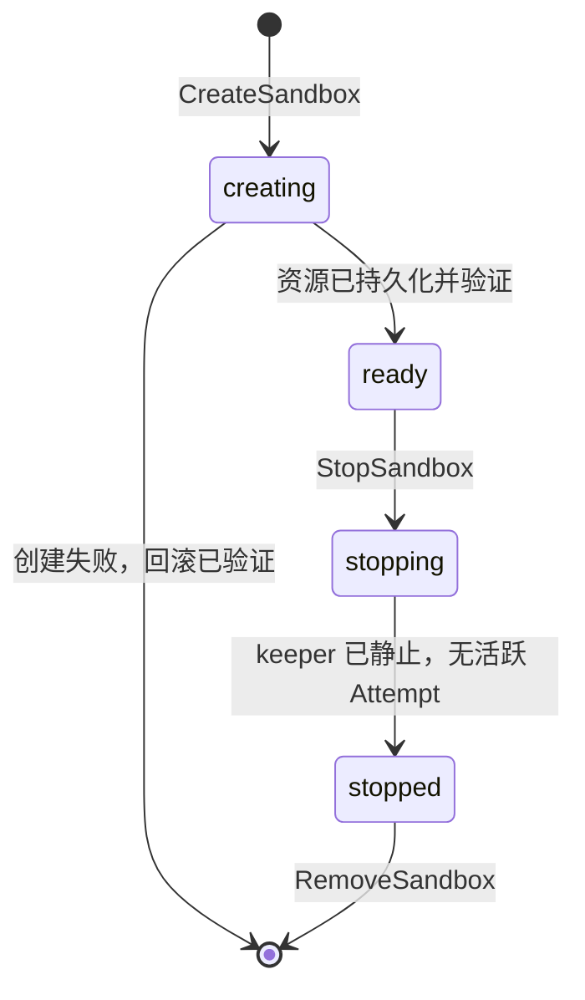
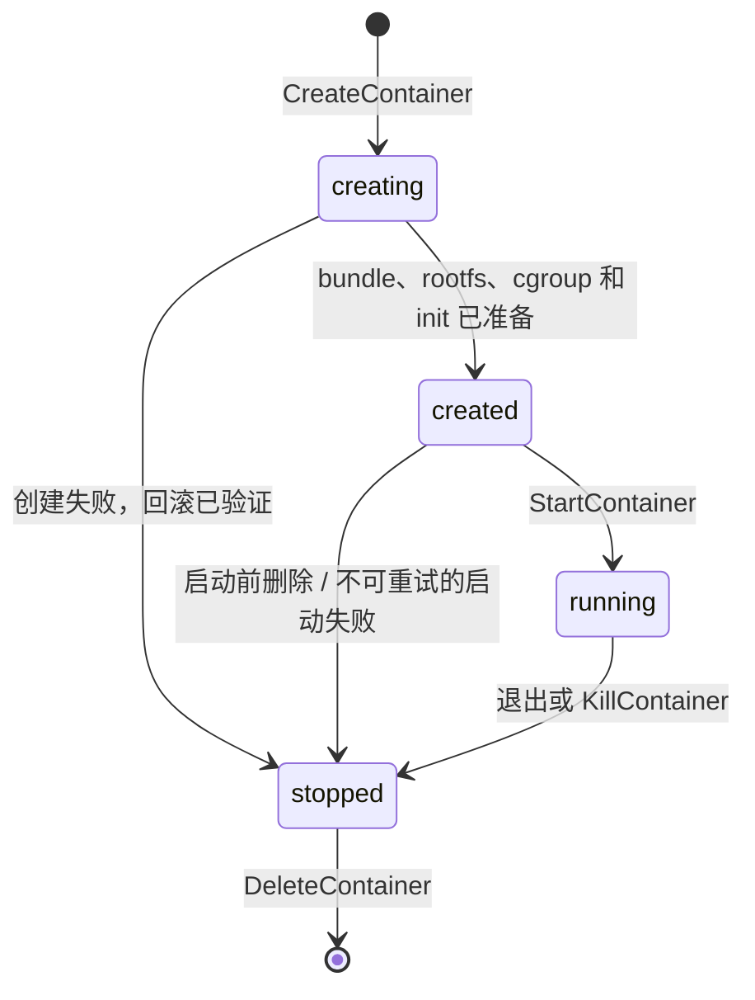

# mydocker 2.0 架构

**状态：** In progress。M1 已验证纯领域模型、状态机、operation/event、rollback、
事务状态边界和两阶段协调契约。M2 已实现 rootful Linux isolation/cgroup v2
原语、宿主机所有权收据与 provider 契约，并通过纯单元测试、race detector 和
静态检查；真实 namespace/mount/cgroup/OOM/quota/PID 1 特权集成验收尚未运行。
M3 已实现 FileStore、engine/shim/provider 编排、带版本的 HTTP/JSON UDS
API、`pkg/client`、CLI、logs/events、recovery 后台 watcher 和评测工具的
纯测试基础，状态仍是 `In progress`。生产 `LinuxShimLauncher` 明确返回
`ErrLauncherIncomplete`，daemon 在 UDS 绑定前失败关闭；因此不声称已有生产
可运行的容器路径。

本文档是跨功能架构的主要依据。生命周期、隔离、镜像与文件系统、网络、
守护进程/API 以及面向集群的详细行为，分别记录在 [`features/`](features/) 下的
对应文档中。

## 1. 目标与非目标

### 目标

mydocker 2.0 定位为 **Node-local Container Execution Engine（单节点容器执行
引擎/执行面）**。它要回答的是：一个 Linux 节点如何以正确、可恢复、可诊断且
可度量的方式，把镜像变成运行中的工作负载并管理其生命周期。它将：

- 将稳定的 Sandbox 与每一次具体的 Container Attempt 分离；
- 明确生命周期转换和所有权；
- 使用守护进程而非短生命周期 CLI 作为生命周期权威；
- 使用 cgroup v2 和父子资源层级；
- 消费 OCI Image Layout，验证内容并将有序 layer 准备为每个 Attempt 的 rootfs；
- 持久化带版本的状态，并在重启后将其与宿主机实际状态进行协调；
- 让部分失败的回滚与重试行为可测试；
- 暴露版本化本地 API，供未来的节点代理调用；
- 先建立正确性和可靠性，再度量并优化性能。

之所以需要完全重写，是因为旧版的状态、PID 所有权、命令编码、cgroup v1
假设以及清理行为都与单体 CLI 紧密耦合。在验证新生命周期模型之前保持这些格式
兼容，会反过来限制新模型。Legacy 版本仍可通过 `v0.1.0-legacy` 定位；选择性复用
必须建立新的边界并配套测试。

### 非目标

2.0 初期不提供：

- 调度、放置、心跳、租约、etcd、集群控制器或节点代理；
- 多节点 overlay 网络或集群 API 服务端；
- 并发边车容器、init container 或完整的 Pod 语义；
- Kubernetes CRI、kubelet 集成或兼容性声明；
- 完整的 OCI 或 containerd 协议兼容性；
- Dockerfile/build graph、构建缓存或其他镜像构建能力；
- 将运行中容器导出为镜像的 `commit`，以及 `push` 或 registry server；
- rootless 运行；
- 在所有权和可达性规则设计完成前进行垃圾回收；
- 在可复现基线定位出真实瓶颈前进行优化。

未来的集群项目回答另一个独立问题：期望的工作负载如何跨多个节点放置、协调和
恢复。它消费本地 API，而不会把运行时内部实现扩散到控制平面。

## 2. 组件模型



依赖通过窄接口指向内层。宿主机相关实现可以依赖 Linux 原语；状态和 engine 包
依赖接口，而不依赖评测工具或未来的集群类型。

上图是目标全路径。当前 M3 已经把 CLI → UDS server → daemon service → engine
→ provider 之间的版本、身份、幂等性和恢复边界组合起来，但这条组合只通过
注入 provider 和临时文件系统测试。真实 shim/keeper/PID 1、hostname/DNS 和
none/loopback 内核设置都被 fail-closed 生产 launcher 阻断，不能从 typed/fake 契约
推断它们已被内核执行。

### 镜像到进程的数据路径

外部 builder 生产镜像；mydocker 只消费镜像，并负责从不可变镜像身份到 Linux
进程之间的节点本地执行路径：


这条路径分为两个可独立恢复和度量的阶段：

1. `ImportImage` 将 OCI Image Layout 解析为镜像对象，ContentStore 原子接收并验证
   manifest、config 和压缩 layer blob，LayerUnpacker 按顺序准备不可变文件系统层；
2. `CreateContainer` 先以解析后的镜像 digest 确认内容可用，再为新的 Attempt
   准备可写 snapshot、挂载 rootfs 与嵌套 mounts、生成带版本 bundle，最后把 bundle
   交给 `mydocker-runtime` 创建受 gate 约束的进程。

镜像引用是可变的用户意图；解析后的 digest 才是执行身份，必须在 Attempt 创建前
持久化。底层 runtime 只理解 bundle、rootfs、结构化进程参数、mounts、namespaces
和 cgroup path；它不理解 tag、registry、layer 下载或 image cache。具体对象、API、
回滚和评测契约见 [image-filesystem.md](features/image-filesystem.md)。

## 3. 核心领域模型

以下是语义定义，而不是 Go 声明。

| 对象 | 含义 |
| --- | --- |
| `Sandbox` | 稳定的工作负载身份，以及共享环境资源的所有者 |
| `SandboxSpec` | 初期不可变的 hostname、DNS、labels、网络及规范工作负载资源 |
| `SandboxStatus` | 观测到的生命周期状态、网络/cgroup 挂接、keeper 身份及 conditions |
| `Container` | Sandbox 下单次执行请求的 API/持久化聚合对象 |
| `Container Attempt` | 面向内核的执行子记录，包含进程和执行资源 |
| `ContainerSpec` | bundle、argv、环境、mounts、rootfs/image，以及解析后强制限制的副本 |
| `ContainerStatus` | 聚合 phase，以及对其规范 Attempt 结果的原子投影 |
| `Image` | 用户和 engine 可见的镜像记录，将可变 reference 映射到已验证的 manifest digest |
| `Content Blob` | 由 digest 标识的不可变 manifest、config 或压缩 layer 内容 |
| `Unpacked Layer` | 校验并应用 OCI layer/whiteout 语义后发布的不可变文件系统层 |
| `Snapshot` | 基于不可变镜像层、由单个 Attempt 独享可写层的文件系统状态 |
| `Bundle` | 由镜像配置、ContainerSpec 覆盖、rootfs、资源与 namespace 配置生成的 runtime 输入 |
| `Resources` | Sandbox spec 中的值，分别包含 requests、limits 和进程限制 |
| `Generation` | 权威组件接受的单调递增期望 spec 修订号 |
| `ObservedGeneration` | 其影响已被协调并报告的最高 generation |
| `OperationID` | 客户端生成的身份，用于标识跨重试和多个 stage 的一次外部生命周期意图 |
| `Event` | 关于某次 operation 或资源转换的有序事实，包含结果和原因类别 |

ID 只用于标识记录；它们不能证明某个宿主机进程或内核资源仍属于该记录。进程
身份必须包含更强的证据，例如 pidfd、进程启动身份，或 supervisor 持有的句柄。

首版 API 保持 Sandbox 和 Container 规格不可变：create 将 `generation = 1`，且仅在
该规格协调完成后，`observed_generation` 才变为 `1`。Start、kill、stop 和 delete
会改变生命周期 phase，但不会增加 spec generation。未来显式的 update API 必须使用
expected-generation 前置条件并递增 generation；在此之前不存在隐式变更或乱序 spec
更新。集群 Task/Assignment generation 属于独立的版本域。Generation 永远不能替代
生命周期 phase 或 event sequence。

## 4. Sandbox 与 Container Attempt 的边界

### 所有权

在初始 API 中，每个用户可见的 `Container` 恰好有一个 `Container Attempt`。
Container 记录拥有不可变的请求/spec 以及查询/日志身份；其 Attempt 拥有内核执行
及执行结果。`CreateContainer` 同时创建二者并返回两个 ID。`GetContainer`、
`ListContainers`、日志和事件都显式暴露 Attempt ID。终态之后的工作负载重试，
会在同一 Sandbox 下创建新的 Container 和 Attempt，而不会修改旧记录。这个一对一
规则为未来一个稳定 Container 对应多个 Attempts 留出空间，同时不会让当前尚不支持
的基数关系产生歧义。

| Sandbox 拥有 | Container Attempt 拥有 |
| --- | --- |
| 稳定 ID 和生命周期 | Attempt ID 和生命周期 |
| UTS、IPC 和 network namespaces | 默认拥有 PID 和 mount namespaces |
| Hostname 和 DNS 配置 | 用户进程及结构化 argv/environment |
| 网络挂接、IP、路由、端口 | 受 OCI 启发的 bundle 和 rootfs/snapshot |
| 父 cgroup 和规范 `Resources` | 子 cgroup 和解析后的强制限制 |
| Labels 和 keeper/supervisor 身份 | 规范 stdout/stderr、退出码、signal、OOM 结果 |

Sandbox 不是空壳。它在顺序执行的多个 Attempts 之间保持工作负载身份和网络可达性，
提供 namespace keeper 边界，并在父 cgroup 下汇总资源计量。这样可以自然映射到未来
集群中的 Task 或工作负载副本，而无需让运行时理解调度。

### 初始基数

一个 Ready Sandbox 最多可以有一对活跃的 Container/Attempt（`creating`、
`created` 或 `running`）。终态 Container/Attempt 记录可以继续供查询，同时允许创建
后续组合。在引入多容器共享之前，将活跃执行串行化可使清理、重试、资源
计量和恢复保持可控。

```text
Sandbox S1 (stable network identity)
├── Container C1 / Attempt A1: stopped, OOM
├── Container C2 / Attempt A2: stopped, start failed
└── Container C3 / Attempt A3: running
```

默认情况下，每个 Attempt 拥有自己的 PID namespace，因此替换执行时会获得全新的
PID 1 和进程树。UTS、IPC 和 network namespaces 属于 Sandbox，因为它们描述共享的
工作负载环境。keeper 或 supervisor 必须独立于用户进程持有这些 namespaces。

并发容器、边车容器、init containers 和共享 PID namespaces 需要新的顺序与
失败语义。它们属于未来扩展，初始模型不隐含这些能力，也不能据此声称兼容 CRI。

操作契约见 [lifecycle-sandbox.md](features/lifecycle-sandbox.md)。

## 5. 生命周期状态机

### Sandbox



规范的外部 phases 为：

```text
absent -> creating -> ready -> stopping -> stopped -> absent
```

失败是某个 phase/operation 上的 condition，而不是额外的生命周期 phase。create
失败会保持 `creating`，并带有失败/清理 condition，直到确认回滚达到 `absent`。
stop 失败会保持 `stopping`，直到重试/协调达到 `stopped`。清理未完成时阻止冲突操作。

`StopSandbox` 要求不存在活跃的 Container/Attempt。`RemoveSandbox` 要求 Sandbox
处于 `stopped`，且每条 Container 记录都已被显式删除；初始 API 不做级联删除。资源
记录被删除后，operation/event 历史可以按自身的保留策略继续存在。Sandbox 的
network/namespace/cgroup 元数据最后删除，且只在确认宿主机上对应资源不存在后删除。

`stopped` 是静止但保留的 Sandbox：它不接受新的 Attempt，而其 keeper 可以仅为持有
既有 namespaces 继续存活，直到执行 `RemoveSandbox`。Remove 会停止 keeper 并销毁
这些保留资源；Stop 不会先销毁它们，再要求 Remove 重复同一工作。

### Container Attempt



规范的外部 phases 为：

```text
absent -> creating -> created -> running -> stopped -> absent
```

Start 使用 gate：创建过程准备 init 进程，但不允许工作负载运行；start 释放 gate，
并确认进入 running。对实际进入过 `running` 的 Attempt，报告 `stopped` 前需捕获退出码、
signal、OOM 或显式 unknown evidence。启动前删除的 `creating/created -> stopped` 不捏造
进程结果，而是记录 `not_applicable`；metadata 删除仍须在外部确认资源不存在之后完成。

create 失败仅在所有已获取的 Attempt 资源都完成回滚后才进入 `stopped`；其
Container/operation 记录保留失败结果，直至 delete。若 gate/init 仍处于可安全重试
状态，start 失败后保持 `created`，否则清理至 `stopped`。delete 失败会保持
`stopped` 并带有清理 condition；在确认拆除完成前绝不报告 `absent`。

### 转换规则

- 必要时，持久转换要在产生非幂等宿主机副作用前记录意图。
- 每个建立步骤都在回滚栈上注册其逆操作。
- 执行第一个逆操作前，必须先封存回滚栈并将 `started` 进度与 operation 原子持久化；
  恢复后的已封存栈不得再追加逆操作。
- 回滚按逆序执行、记录每个失败，并且可以安全重试。
- 客户端在首次发送前生成 operation ID。使用该 ID 和相同规范请求指纹的重复请求，
  会返回/恢复已存储的结果；用不同请求体复用该 ID 会被拒绝。
- 对已达成状态重复执行 delete/stop 会成功返回，且不会重复产生副作用。
- 同一资源上的冲突操作会被串行化或被显式拒绝。
- 守护进程重启后加载持久意图、观察宿主机资源并协调差异；它绝不只信任元数据。
- 恢复可以继续执行、回滚或附加失败/清理 condition，但不能凭空宣称成功或终态。

## 6. 职责与依赖方向

### CLI

校验用户输入、发送结构化请求、流式传输响应，并将类型化错误映射为退出状态。它不
拥有任何守护进程状态，也不能监督后台工作负载。

### `mydockerd`

拥有本地 API、资源串行化、持久元数据、Sandbox/Container 协调、事件/日志/指标
发布，以及重启后的协调。

### Engine

实现用例顺序、状态机守卫、幂等性、回滚栈，以及 image/content/unpack/snapshot/
mount/bundle、network、runtime 和 state 接口之间的协调。它不会通过 CLI 字符串发出
临时拼装的 shell 命令。

### `mydocker-runtime`

理解 bundle、process、namespace、mount、rootfs、cgroup 挂接以及底层生命周期原语。
它不理解镜像 reference/tag、registry、layer 获取或 image cache，也不理解 Task、Node、
心跳、调度器、租约、assignment 或集群期望状态。

### Shim 或 supervisor

每个 Sandbox 对应一个长期运行实例；按设计持有 namespace 或进程身份，收集 exit
status，并在守护进程重启后保持可重连。namespace keeper 由 shim 自身还是其子进程
担任，是后续里程碑的实现决策。

### 网络

通过幂等操作创建和拆除 Sandbox 范围的 network namespaces、veth/bridge 挂接、
本地 IP 分配、路由和端口映射。

### ImageService

拥有用户和 engine 可见的镜像对象、reference 到 digest 的映射以及镜像可用性。
首版公开操作是 `ImportImage`、`EnsureImage`、`GetImage`、`ListImages` 和
`RemoveImage`；未来可以按 digest 增加 `PullImage`，但不规划 `BuildImage`、
`CommitContainer` 或 `PushImage`。

### ContentStore

以 digest 保存并校验不可变 manifest、config 和压缩 layer blob，提供原子写入、
读取、状态查询和受引用保护的显式删除。它不解析 tag，不创建 snapshot，也不决定
Attempt 生命周期。

### LayerUnpacker

读取已验证的 layer blob，校验解压内容，按顺序应用 OCI whiteout 语义，并原子发布
不可变 unpacked layer。它拒绝路径遍历和链接逃逸，不创建 Attempt 可写层或真实 mount。

### Snapshotter

以不可变 image filesystem 为 parent，为每个 Attempt 准备独享的 upper/work 数据，
并通过 `Prepare`、`Mounts`、`Usage` 和 `Remove` 暴露最小 snapshot 语义。它不理解
image tag、Task、Sandbox 网络或用户 CLI。

### MountManager

执行并验证 OverlayFS、bind、`/proc` 和 tmpfs 等 mount，处理 read-only rootfs 与
mount propagation，并按依赖逆序 unmount。daemon 恢复时，它只接管能够证明属于
mydocker 的 mount。

### BundleBuilder

把 image config、ContainerSpec 覆盖、rootfs mount、资源和 namespace 配置转换为
带版本且可验证的 bundle。它不下载或解包镜像，也不启动进程。

### 状态存储

提供原子且带版本的记录，以及 operation/event 排序。它不是未经验证 PID 的缓存。
M1 已定义 Store/Tx 接口和仅供确定性单元测试使用的 copy-on-write 内存实现，验证
schema、CAS、跨记录完整性、operation/rollback/event 原子性和严格事件顺序。M3
选用单 daemon `FileStore`：它使用独占锁、owner-only 文件、checksum envelope、
原子替换与文件/父目录同步，成功 Update 后才更新内存可见性；对于 rename
后持久性不确定的失败，当前实例被 poison，需 close/reopen 后从盘面事实恢复。
它已覆盖 daemon restart 所需的状态重放纯测试，并使用 schema-v2 的同一原子 snapshot
完成 count-based operation/event retention 与 compaction。默认保留最近 `1024` 个终态
operation 的完整响应、最多 `65536` 个完整 identity 或 tombstone、最近 `8192` 个 event；
启动读取和每次编码另受 `64 MiB` envelope 上限保护。达到 identity 或 envelope 上限时
在新 intent/commit 前失败关闭。当前尚无在线状态 rollover/归档，因此有界不等于可以
无限期生产运行。

### 可观测性

当前已有按 operation/resource 关联的持久 stage events、daemon 结构化日志、
以及按 Container/Attempt 身份绑定、带 checksum 和 cursor 的 stdout/stderr
frames。事件和 log cursor 支持有界分页；它们自身不是 benchmark 事实。
低基数 metrics 仍是后续目标，不得用现有日志/事件推断已实现 Prometheus 契约。

### 未来的 agent

监听 assignments、协调期望/实际状态、报告节点/工作负载状态，并调用版本化
本地 API。它不能导入 engine/runtime 内部实现，也不能绕过 `mydockerd` 修改本地文件、
PIDs、cgroups 或 namespaces。

## 7. 状态、事件与度量边界

每个公共生命周期 operation 预留以下上下文：

```text
request_id
operation_id
trace context
resource kind and resource ID
operation type
event sequence
stage
result
reason class
wall-clock timestamp
monotonic duration where available
generation
observed_generation
```

`request_id` 关联一次传输请求。客户端在首次发送前创建 `operation_id`；它标识持久
生命周期意图，即使首次响应丢失及后续发生传输重试也保持不变。当前服务端
将其绑定到 operation type、target 和规范请求指纹，并持久 terminal response 用于
同 ID 重放。一次 operation 会按适用
情况发出有序的 stage events，例如 `validate`、`persist_intent`、`prepare_rootfs`、
`attach_cgroup`、`configure_network`、`release_start_gate` 和 `persist_result`。

事件支持恢复、诊断和阶段时长分析。FileStore 保留连续的 event suffix；空 resume token
从当前最早可用事件读取，非空 token 落在已清理前缀或超过最新已提交 sequence 时返回
版本化 `resume_gap`，不会把缺口或 future cursor 伪装成空页。完整终态 operation 超出
replay window 后转换为保留 type、target、
fingerprint、reason 和顺序的 ID-digest tombstone；相同 ID 返回 `operation_expired`，
不会作为新 intent 接受。达到总 identity 上限返回 `resource_exhausted`，需要显式状态
迁移/轮换。runtime 元数据中的时间戳记录一个事实；它不会自动成为精确的 benchmark
观测值。

两类计时保持分离。调用方可见的 API 延迟，使用同一评测进程的单调时钟，从发送前
一刻计至观察到响应/已确认结果。守护进程的 operation/stage 时长使用该守护进程的
单调时钟，从接受请求计至其收到/确认终态；不得跨进程相减 supervisor 的时间戳。
跨进程或跨节点时，不得把未同步时间戳当作共享同一个时钟而直接相减。追踪可以展示
因果分解，但必须记录时钟限制。

精确的指标边界在 [evaluation/README.md](../evaluation/README.md) 中定义。

## 8. 可观测性与 benchmark 的区别

| 机制 | 主要问题 | 身份策略 |
| --- | --- | --- |
| 指标 | 当前发生了什么聚合趋势或速率？ | 仅使用低基数 labels |
| 结构化日志 | 这个具体资源/operation 发生了什么？ | 允许将 ID 和详细错误作为 fields |
| 追踪 | 时间和失败在组件间如何传播？ | trace/span context 加具体 ID |
| Benchmark 评测工具 | 受控场景在已记录条件下表现如何？ | 在原始结果中记录实验/sample 身份 |

Prometheus labels 不得包含 `sandbox_id`、`container_id`、`task_id`、
`operation_id`、镜像 digest 或完整错误字符串。在词汇表定义后，有界 labels 可以
包含 operation type、stage、result 和 reason class。

一次 scrape 会聚合观测，且可能漏掉短暂事件；它不是精确延迟 sample 的唯一
来源。benchmark 评测工具调用公共 API、定义 sample 边界、记录失败和原始结果，
并固定环境。

## 9. 数据目录

推荐的宿主机布局：

```text
/var/lib/mydocker/   durable, restart-relevant state
/run/mydocker/       boot-scoped sockets, locks, pidfds/handles and transient state
```

当前 `mydockerd` 不隐式选择这些路径：`--state`、`--runtime-root` 和
`--socket` 都要求干净的绝对非根路径，`--cgroup-root`、`--shim` 和至少一个
`--prepared-rootfs ID=/absolute/path` 也必须显式给出。`FileStore` 保存带
schema version 的 Sandbox/Container/Attempt、operation、rollback 和 event 记录；
runtime root 存放 owner-bound shim/config/terminal/log artifacts。镜像 content、unpacked layers、
snapshots 和持久网络分配属于 M4A–M4C，当前并不存在。

守护进程必须容忍 `/run/mydocker` 在重启后消失，并根据持久意图和宿主机观测重建它。
FileStore 和当前 workload log 已明确文件同步、目录同步、所有者/权限与
不确定 commit 边界；operation/event 已采用上述固定数量与 gap 规则。secrets、长期
workload 日志，以及达到 identity/envelope 上限后的在线轮换仍需生产策略。

## 10. 目标代码与评测布局

当前 M1–M3 实际创建的主要布局为：

```text
go.mod
api/runtime/v1/
cmd/
├── mydocker/
├── mydockerd/
└── mydocker-shim/
internal/
├── domain/
├── lifecycle/
├── operation/
├── rollback/
├── state/
├── ownership/
├── cgroupv2/
├── isolation/
├── provider/
├── slim/
├── shim/
├── engine/
├── daemon/
├── server/
├── logstore/
└── observability/
pkg/client/
evaluation/
├── cmd/mydocker-eval/
└── scenarios/
```

其中 `cmd/mydocker-shim`、`internal/slim` 和 provider 编排已有协议/纯测试实现，
但并不表示生产 Linux launcher 已可以创建它们。以下仍是 M4A–M4C 的目标
布局，不代表对应组件已经实现或集成：

```text
internal/
├── image/
├── content/
├── unpack/
├── snapshot/
├── mount/
├── bundle/
└── network/
```

只在有真实实现、测试或实验数据时创建目录。生产代码绝不导入评测工具。评测工具
通过公共 API 做端到端度量；包级 Go benchmark 仅作为微基准。故障注入使用接口
包装器、测试替身或明确仅供测试的构建，
而不是在生产路径中散布随机条件。

## 11. 分支策略

概念上的三阶段模型仍是 Legacy、单节点 2.0、再到集群。实际仓库名称和拓扑才是
权威依据：

| 阶段 | 实际 ref | 规则 |
| --- | --- | --- |
| Legacy 教程版 | `origin/legacy/v1`、`v0.1.0-legacy` | 冻结的参考版本；不进行 2.0 开发 |
| 2.0 单节点执行引擎 | 从现有空 `main` 根创建的 `mydocker-2.0` | 单节点代码、API、可靠性、评测 |
| mycluster 控制面 | 未来的 `mydocker-cluster` 分支 | 仅从已验证的 2.0 tag/commit 派生 |

原始方案把 Legacy 分支称为 `master`，但此仓库没有 `master`。`main` 是用于 2.0
初始化的独立空根，并不是 Legacy commit。M0 不虚构或重命名分支，不合并无关
的根，不重写历史、不推送 refs，也不改变远端默认分支。

创建集群分支必须满足 [roadmap.md](roadmap.md) 的 C0 发布门槛或完整等效 alpha
门槛。等效 alpha 证据包括稳定的 Sandbox/Attempt 生命周期、可用的
namespace/cgroup v2 与 image/snapshot/network 最小路径、版本化本地 API、经过测试的
daemon recovery/operation 幂等性，以及可复现的节点本地 baseline；它不强制先完成
M6 的最终性能优化。runtime 修复必须先落到 `mydocker-2.0` 并通过验证；仅限集群的
控制器/调度器变更留在集群中。API 变更在 2.0 中设计。

每个集群结果都记录其准确的 mydocker 基础 commit。不同分支、机器、kernel 或场景的
结果，若未经受控实验且未明确列出差异，不得声称可比。

## 12. 关键决策

| ID | 决策 | 影响 |
| --- | --- | --- |
| D1 | 完全重写 | 不以兼容 Legacy 代码/状态/CLI 为目标 |
| D2 | Sandbox 是一等资源 | 网络身份、共享 namespaces 和父 cgroup 可跨顺序 Attempts 保持 |
| D3 | 初期只允许一个活跃 Attempt | 模型成熟过程中，生命周期和恢复保持确定性 |
| D4 | 仅支持 cgroup v2 | 不为 Legacy v1 controller 文件提供兼容层 |
| D5 | CLI 调用 daemon API | 后台生命周期拥有长期运行的权威组件 |
| D6 | 集群使用版本化本地 API | 控制平面无法绕过节点所有权边界 |
| D7 | Requests 与 limits 分离 | 不混淆调度意图与本地强制执行 |
| D8 | 目前不实现 CRI | 借鉴资源模型不意味着协议兼容 |
| D9 | 评测优先，而非优化优先 | 先定义边界、验证行为、建立基线、分析性能剖析数据，再优化 |
| D10 | 测试类别保持分离 | 正确性、benchmark、压力、故障和 profiling 证据不可互换 |
| D11 | 镜像消费属于单节点执行面 | OCI image 必须经过 content、unpack、snapshot、mount 和 bundle 边界后才进入 runtime |
| D12 | 镜像生产不属于 2.0 核心范围 | 不实现 Dockerfile build、container commit、push 或 registry server |

这些决策集中保留在此处，而不拆分成独立 ADR 文件。未来的变更需要同时更新此表，
以及归属该变更的 feature/evaluation 契约。
