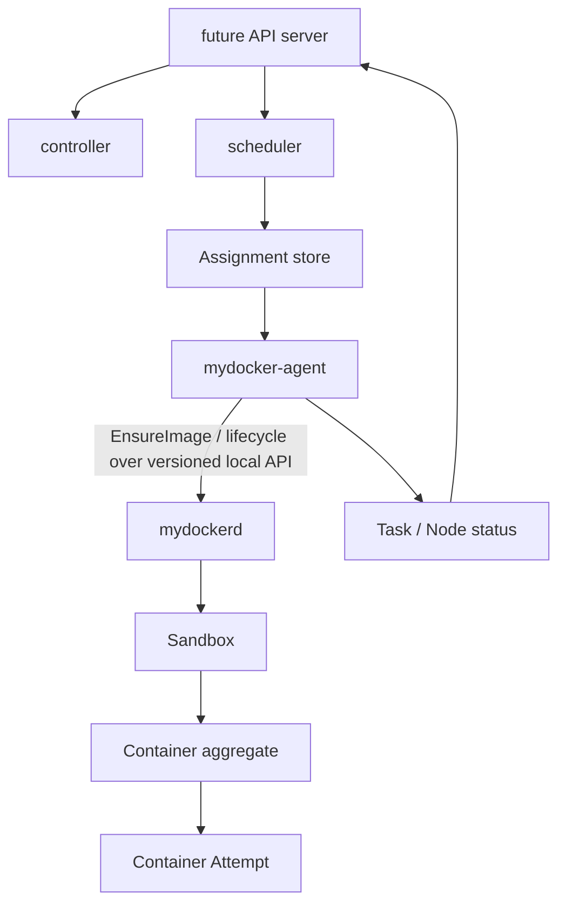

# 未来 mycluster：分布式工作负载控制面兼容性

## 状态

**Planned。** M0 阶段有意不创建集群分支及任何集群组件。本文档约束 2.0 的本地
边界，确保后续集群不会绕过该边界；本文档不是集群实现规范。

## 目的

未来的 mycluster 定位为 **Distributed Workload Control Plane（分布式工作负载
控制面）**：决定 workload 应该在哪个节点运行，并持续调谐期望状态与实际状态。
它通过带版本的 `mydockerd` API 调度、分配、调谐和恢复工作负载，同时保持单节点
所有权、幂等性，以及可单独测量的运行时延迟。

## 范围

未来集群的范围包括：

- 节点注册/状态、heartbeat 和 Lease；
- Task 期望状态、Assignment 投递和 Task 观测状态；
- 使用 etcd 持久化控制面期望/实际状态，并通过事务与 watch 支持调谐；
- controller 与 agent 的调谐循环；
- 基于资源请求的调度，以及 Spread 和 Bin-Packing 策略；
- at-least-once 投递、重试、节点故障、重新调度和恢复测量；
- control-plane 链路追踪和模拟 agent 规模评测。

M0/2.0 不实现 API server、controller、scheduler、node agent、etcd、heartbeat、
placement、多节点 overlay 或集群 API，也不作任何 Kubernetes 兼容性声明。
未来的 mycluster 也不直接操作 namespace、mount、cgroup、rootfs 或宿主机 PID，
不监督节点本地进程，也不构建、解包或挂载镜像。它不复刻完整 Kubernetes API/对象，
也不自研 Raft；etcd 的共识实现属于依赖边界。

## 核心对象与流程

### 未来的领域对象

| 对象 | 含义 |
| --- | --- |
| `Node` | 稳定且可调度的节点身份，以及声明的能力 |
| `NodeStatus` | 观测到的容量、可分配资源、condition 和运行时基础版本 |
| `Lease` | 与工作负载状态分离、具有时间界限的存活观测 |
| `Task` | 稳定的期望工作负载或副本身份 |
| `TaskSpec` | 不可变的 `ImageDigest`、命令/环境、资源、策略和 generation |
| `Assignment` | 将某个 Task generation 绑定到某个 Node 的带版本指令 |
| `TaskStatus` | controller 观测到的 phase，以及关联的 Sandbox、Container 和 Attempt ID/结果 |
| `Container` | 对应一次执行请求的节点本地 API/持久化聚合体 |
| `Container Attempt` | 由该 Container 所有、与之对应的一次面向内核的执行 |
| `Generation` | 已接受的期望状态修订版本 |
| `ObservedGeneration` | 相关权威已完成调谐的最高修订版本 |

映射关系：

```text
Task / workload replica (stable desired identity)
        |
        v
Sandbox (stable node-local workload environment)
        |
        v
Container (API/persistence aggregate)
        |
        v
Container Attempt (one kernel execution)
```

工作负载在终态后重试或发生重新调度时，会创建新的 Container/Attempt 身份。传输重试、
重复的 Assignment 投递和响应丢失会复用同一个 Attempt-intent 及本地操作身份；它们
不会创建新的执行。只有当 Assignment 仍以该节点为目标，且本地策略确认 Sandbox
仍然有效时，节点本地的工作负载重试才可以复用 Sandbox。重新调度到其他节点时会创建
不同的本地 Sandbox，同时保留 Task 身份。

### 期望状态与实际状态

API server 持久化期望的 Task generation。scheduler 使用符合条件的容量快照选择
Node，并记录一条 Assignment。node agent 至少观测一次该 Assignment，将其转换为
幂等的本地 API 操作，并报告实际的 Sandbox、Container 和 Attempt ID/state。
controller 对 Task 期望状态与上报状态进行调谐，直至
`observed_generation` 收敛。

任何组件都不会将一次 RPC 响应视为全局事实。Assignment、本地操作和状态报告都具有
稳定身份和重试契约。过期 generation 会被忽略或显式拒绝。

### 本地 API 边界



agent 只能使用公共 API 或 `pkg/client`。它不得导入 `internal/runtime`、
打开 namespace handle、向 PID 发送 signal、写入 cgroup、编辑本地元数据，或直接创建
网络资源。`mydockerd` 仍是节点本地生命周期和恢复的权威。

## 关键设计

### 投递与幂等性

- Assignment 投递采用 at-least-once 语义；重复投递属于预期行为。
- Assignment 身份包含 Task、generation、目标 Node，以及能够跨重复投递保持稳定的
  Attempt-intent ID。
- agent 派生稳定的本地 operation ID，使重试不会重复创建 Sandbox 或 Attempt。
- 本地不可变 spec generation/observed-generation 与 Task/Assignment generation
  属于不同的版本域；显式 API 字段负责映射二者，但不将二者等同。
- 响应丢失会触发 operation lookup/重试，而不是发起没有关联关系的创建操作。

### 资源与调度

- 规范的 Sandbox `Resources` 值包含用于调度的 `CPURequestMilli` 和
  `MemoryRequestBytes`，以及用于解析后本地 Attempt 限制的 `CPULimitMilli`、
  `MemoryLimitBytes` 和 `PidsLimit`。
- 请求值与限制值在整个端到端流程中始终保持分离。
- Spread 在选定的拓扑/负载维度上实现均衡；Bin-Packing 使用声明的评分集中部署
  工作负载。策略名称并不表示其中一种普遍优于另一种。
- 调度决策记录足以用于诊断的输入 snapshot/generation。

### 镜像获取与节点准备

`TaskSpec.ImageDigest` 是实际执行的不可变内容身份。Tag 或其他可变引用必须在
Task generation 被接受前解析为 digest；agent 不得在节点上将同一 Task
自行解析为另一份内容。

节点调谐的顺序为：

```text
TaskSpec.ImageDigest
-> scheduler 选择 Node
-> Assignment
-> agent reconcile / Agent.EnsureImage(ImageDigest)
-> mydockerd.EnsureImage(ImageDigest)
-> CreateSandbox
-> CreateContainer
-> StartContainer
```

`Agent.EnsureImage` 是 agent 调谐步骤，而不是 agent 自行处理文件系统。它只能调用
`mydockerd` 的版本化本地 API；内容校验、layer unpack、snapshot 和 mount
仍属于节点本地 engine。

Cluster MVP 采用 **preloaded-image** 策略：运行实验前，将 OCI Image Layout
按 digest 导入所有候选节点。`EnsureImage` 只校验本地 content 和 unpacked
layers 是否完整，不进行网络获取。如果 digest 缺失、内容损坏或无法准备：

- daemon 对缺失内容返回 `ImageUnavailable`，对摘要不匹配或损坏内容返回
  `ContentInvalid`，保留可诊断的本地原因；
- agent 将两类失败统一映射为带 Assignment/generation 和 reason 关联的
  `TaskStatus.ImageUnavailable`，不创建一个使用其他镜像的 Container，也不把 Task
  报告为 Running；
- controller 按明确的 retry/reassignment 策略调谐；重试仍使用相同 digest
  和稳定本地 operation identity。

后续可选增强是由 `mydockerd` 按 digest 进行 registry pull。该策略必须明确
timeout、backoff、鉴权和 digest 校验，且不改变 `TaskSpec.ImageDigest`；它不是
Cluster MVP 的前置条件。

镜像本地性也只是可选的后续 placement signal。在 CPU/memory 资源合格的
多个节点之间，scheduler 可以优先选择已缓存该 digest 的节点，但必须先完成
基础 Spread/Bin-Packing 正确性。缓存清单可作为 NodeStatus/调度输入，不得将
image digest 作为 Prometheus label，缓存命中也不改变 Task 身份或正确性。

### 存活性与恢复

- heartbeat 上报观测结果；Lease 定义故障检测截止时间。
- Lease 过期时，只能按照已记录的状态机将 Node 标记为不可用。
- Node 故障、agent 重启、controller 重启和 control-plane 断连是不同的场景。
- 重新调度会产生新的 Attempt，并在发生网络分区的旧节点恢复时防止出现重复的活跃
  工作负载。
- control-plane 断连并不授权 agent 绕过本地策略；必须明确规定工作负载的继续/终止
  行为。
- 镜像引用会解析为摘要，以确保不同节点运行预期内容；缓存是否存在只是观测到的
  优化条件，不属于身份。

### 链路追踪

未来的分布式链路追踪上下文覆盖 Submit、persist、schedule、assign、agent
reconcile、本地操作和状态观测。Operation/Task/Sandbox/Attempt ID 仍作为结构化
log/trace 字段，而不作为 Prometheus label。

## 故障与恢复

未来必须覆盖的故障场景包括：

- 重复 Assignment 和重复的本地生命周期请求；
- 本地操作成功后响应丢失；
- 本地状态变更前/后 agent 崩溃；
- controller 或 scheduler 重启；
- RPC 超时、延迟、丢包和临时网络分区；
- Lease 过期，以及替代实例启动后旧节点恢复；
- 旧 status 或 generation 在新版本之后到达；
- 某个节点上的镜像摘要不可用/损坏，以及 `ImageUnavailable` 上报前后
  agent 崩溃或响应丢失。

controller 持续执行调谐，直至期望状态与实际状态一致；同时，安全约束禁止隐藏并发
所有权。重复 Task/Attempt 计数和状态不一致计数是显式的可靠性指标。恢复时间拆分为
检测、调度、投递、节点本地启动和观测阶段。

## 可观测性与评测点

端到端边界为：

```text
Submit
-> desired state persisted
-> scheduled
-> Assignment delivered
-> agent reconciled
-> Sandbox Ready
-> Container Running
-> Running status observed by controller
```

至少报告：

- 调度队列延迟和 scheduler 执行延迟；
- Assignment 投递延迟；
- agent reconcile 排队/执行延迟；
- 镜像准备结果和 `EnsureImage` 延迟，并声明 preloaded/cache-hit/cache-miss；
- 若实现可选 pull，单独报告 registry fetch、digest verification 和 layer
  unpack 延迟；
- 单独报告 snapshot preparation 与节点本地 runtime startup 延迟；
- 节点本地 Sandbox/Container 启动延迟；
- SubmitTask-to-Running latency 和 SubmitTask-to-controller-observed latency；
- 调度吞吐量和调谐吞吐量；
- scheduler/controller CPU 和内存用量；
- heartbeat 开销；
- 故障检测、重新调度和总恢复时间/MTTR；
- 重复 Task/Attempt、状态不一致和故障场景成功次数。

control-plane、image acquisition、snapshot preparation 和 runtime startup 延迟分别
报告。SubmitTask-to-Running 可以作为总边界，但不能把 image pull 或 layer
unpack 隐藏在这一个不透明数字中；否则无法定位瓶颈或进行 cold/warm 比较。

规模测试可以使用模拟 agent 评测 scheduler/controller 容量，而无需启动真实
Container。每项结果都必须将执行模型标注为模拟或真实节点端到端；二者不可互换。
集群实验记录准确的 mydocker 基础 commit、集群 commit、节点数、任务数、环境、场景
和原始结果。

计划的场景和结果规则见
[evaluation/README.md](../../evaluation/README.md)。

## 未来的运行时兼容性

只有在某个明确的 2.0 tag 或 commit 满足 [roadmap.md](../roadmap.md) 的 C0 发布门槛
或全部等效 alpha 门槛后，才可以创建集群分支。等效 alpha 要求生命周期、
namespace/cgroup v2、image/snapshot/network 最小路径、版本化本地 API、daemon
recovery/operation 幂等性测试和可复现节点基线同时具备；不要求先完成最终性能优化。
运行时/公共 API 修复先落入 `mydocker-2.0`，再集成到集群；集群专有的
control-plane 变更不回流到运行时。

agent 所需的 API 变更先在本地完成设计和验证。每次集群基准测试都记录其运行时基础
commit，以免后续运行时变更在没有说明的情况下使对比失效。

这种分离为未来的 CRI 或 Kubernetes 适配器留出空间，但当前的 Task、Sandbox、
Assignment 和 Lease 对象是项目特有对象，不作任何协议或行为兼容性声明。

## 验收条件

只有满足 [roadmap.md](../roadmap.md) 中的分支创建门槛后，才能开始集群工作。
未来功能仅在满足以下条件时才达到 **Verified** 状态：

- 重复/乱序 Assignment 测试能够收敛，且不会产生重复的活跃工作负载；
- agent/controller 重启和 control-plane 断连保持明确定义的语义；
- 基于请求的调度与限制执行保持分离且行为正确；
- 对于已记录的输入，Spread/Bin-Packing 决策是确定性的；
- Lease/节点故障状态机和重新调度通过故障场景测试；
- 模拟规模测试结果与真实节点 E2E 结果明确分开；
- preloaded-image MVP 能在所有合格节点上按 `TaskSpec.ImageDigest` 启动，
  缺失/损坏内容会可观测地收敛到 `ImageUnavailable` 而不是其他镜像；
- 若实现 pull 或 image-locality 策略，digest 校验、重试/下载失败及
  确定性 placement 测试通过；这些可选能力不是 Cluster MVP 门槛；
- E2E 阶段 timestamp/trace 能够解释排队、调度、投递、本地运行时和观测各阶段；
- 每项结果都固定 mydocker 基础 commit 和完整的环境元数据。

## 未决问题

- etcd key schema、事务/watch、compaction 以及 control-plane 一致性边界。
- 同节点重试与跨节点重新调度时的 Task-to-Sandbox 身份关系。
- 替代实例启动后，发生过网络分区的节点恢复时所采用的 fencing 策略。
- 资源预留/超额分配和 scheduler snapshot 语义。
- heartbeat 与 Lease 的频率，以及故障检测的权衡。
- 真实节点测试拓扑和模拟器保真度标准。
